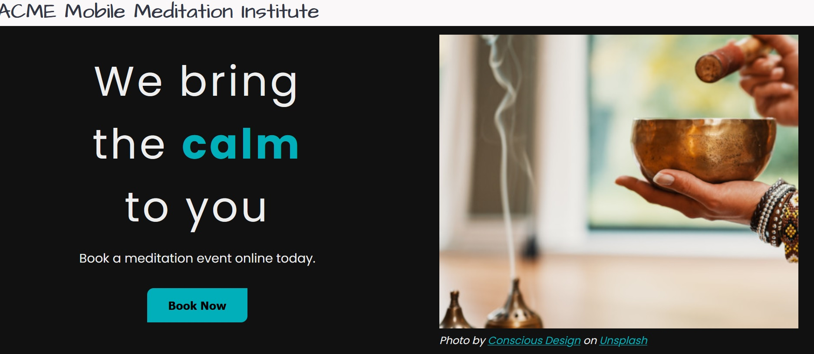

# ACME Meditation

An animated React portfolio website with three pages: home, about, and contact. Uses styled components instead of Sass.



## Get Started

1. Clone the remote. `git clone https://github.com/hdevilbiss/react-portfolio-website.git`
1. Move into the new folder. `cd react-portfolio-website`
1. Install the Node dependencies. `npm i`
1. Start the server; a browser will pop up after some time. `npm start`

**This project was bootstrapped with [Create React App](https://github.com/facebook/create-react-app).**

## Routing

The `react-router-dom` package enables page routing.

```jsx
import {Switch, Route} from "react-router-dom";
```

The Route component has a path attribute which tells under which URI paths to render its containing items.

For example, anytime that `/` is present in the URI, the `<Home />` component will be rendered.

```jsx
<Route path="/">
    <Home />
</Route>
```

This is true for URIs `/`, `/contact`, `/shop`... Any time that `/` is there.

### Switch

To ensure that `<Home />` only renders on exactly `/`, wrap all the routes inside of a switch component, providing an **`exact` attribute** to the base URI, `/`.

```jsx
<Switch>
    <Route path="/" exact>
        <Home />
    </Route>
    <Route path="/work">
        <OurWork />
    </Route>
    <Route path="/contact">
        <ContactUs />
    </Route>
</Switch>`
```

### Link

The React Router DOM package has a `Link` component which can be used in place of HTML `<a>` tags. Instead of an `href` attribute, `<Link>` uses a `to` attribute.

```jsx
<ul>
{links.map(({name, route}, idx) => {
    return (
    <li key={idx}>
        <Link to={route}>
        {name}
        </Link>
    </li>
    )
})}
</ul>
```
